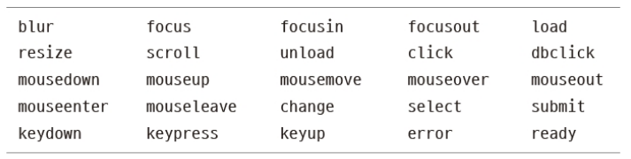

# iot-webapp-2025

<p>IoT 개발자 과정 <a href="https://dotnet.microsoft.com/ko-kr/apps/aspnet">ASP.NET Core</a> 학습 리포지토리</p>

## 1일차

### Web
- 인터넷 상에 사용되는 서비스 중 하나
- 웹을 표현하는 기술 : HTML(Hyper Text Markup Language). XML(eXtensable Markup Language)의 경량화 버전
- 2014년 이후 HTML5로 적용되고 있음

#### 웹 기술
- 웹 표준기술(프론트엔드) : HTML5(웹 페이지 구조) + CSS3(디자인) + JavaScript6(인터렉티브)
- 웹 `서버`기술(백엔드) : ASP.NET Core(C#|VB), SpringBoot(Java), Flask|dJango(Python), CGI(PHP, C), Ruby, ...
- 웹 서비스 : 프론트엔드 + 백엔드
- 웹 브라우저 상에서 동작 : 현재는 웹 브라우저 상에서만 동작하는 경계가 사라졌음

#### HTML 5
- 웹 페이지를 구성하는 언어(근간, 기본)
- HTML 상에서도 디자인을 할 수 있으나, 현재는 CSS로 분기

### CSS 3
- Cascading Style Sheet : 객체 지향에 사용되는 부모 자식 관계로 디자인하는 기술
- 아주 쉬운 문법으로 구성됨

#### JavaScript 6
- 표준명 ECMAScript 2024
- Java와 전혀 관계없음. Java의 문법을 차용해서 사용한 웹 스크립트 언어
- 엄청난 발전을 이뤄 여러가지 기술로 분리
    - React.js, View.js 등의 프론트엔드 기술 언어로 분파
    - Node.js와 같은 웹 서버기술에도 적용
    - VS Code(아톰에디터 기반) 같은 개발도구를 만드는데도 사용
    - 3D 게임, 모바일 개발 등 다양한 분야에 사용

#### 웹 서버 기술
- `ASP.NET Core` : C#/VB 언어도 웹 서버를 개발
- SpringBoot, Flask 등 다른 언어로 웹 서버를 개발해도 무방

#### 왜 웹을 공부해야 하나?
- 스마트팩토리 솔루션을 대부분 웹으로 개발(사용 범위 제약을 없애기 위해)
    - 웹 사이트, 일부분 - 모바일 앱, 동시 개발
- 스마트홈(IoT), ERP, 호텔 예약, 인터넷뱅킹, 온라인 서점, ...
- 모든 IT/ITC 개발에 웹 기술은 포함되어 있음'

#### HTTP
- HyperText Transfer Protocol
- 웹을 요청/응답하는 프로토콜
- HTTPs : HTTP with secure. 보안을 강화한 HTTP 프로토콜

### 웹 표준기술 HTML

#### VS Code 확장설치
- Live Server

#### HTML 구조
- [소스](./day01/html01.html)
- html 태그 내에 head, body로 구성(무조건!)
- README.md에도 HTML 코드를 그대로 사용 가능(heading은 적용 불가)
- VS Code에서 html:5 자동생성
- [소스](./day01/html02.html), [소스](./day01/html03.html)
- CSS가 소스라인을 많이 사용. css는 외부 스타일로 분리 사용
- JS도 소스라인이 매우 김. JS도 외부 스크립트로 분리 사용
- 웹 브라우저의 개발자 모드(F12)로 디버깅을 하는 것이 일반적

#### HTML 기본 태그(body에 사용)
- [소스](./day01/html04.html)
- h1 ~ h6 : 제목 글자
- p, br, hr : 본문, 한 줄 내려가기, 가로줄
- a : 링크
- b/strong, i, small, sub, sup, ins/u, del : 굵은체, 이탤릭체, 작은 글씨, 아래첨자, 위첨자, 밑줄, 취소선
- Ul/ol, li : 동그라미 목록/순법 목록, 목록아이템
- table, tr, th, td : 테이블, 테이블로우, 테이블 헤더, 테이블컬럼
- img, audio, video :  이미지, 오디오, 비디오
- [소스](./day01/html05.html), (./day01/html06.html)
- form, input, button, select, textarea, label : 입력 양식, 텍스트박스, 버튼, 콤보박스, 여러줄텍스트, 라벨
- progress : 진행률
- div, span : 공간 분할

#### 공간 분할 태그
- [소스](./day01/html07.html)
- div 사용 이전엔 table, tr, td로 화면 분할을 활용
- table을 여러 번 중복하면 렌더링 속도 저하로 화면이 빨리 표시되지 않음
- 웹 기술 표준을 적용해 div 태그로 공간 분할 시작
- div를 CSS로 디자인 적용 해서 렌더링 속도를 빠르게 변경
- 게시판 목록, 상세보기 등에서는 아직도 table 사용 중

#### 시맨틱웹
- 웹 구조를 좀 더 구조적으로 세밀하게 구분짓는 의미로 만들어진 웹 구성 방식
- 시맨틱 태그
    - header, nav, main, section, aside, article, footer 등
    - 기본 HTML 태그가 아니고 필수도 아님
- 최근에는 잘 사용하지 않음. div 태그에 id로 부여해 유사하게 사용 중
- div만 잘 쓰면 됨

### 웹 표준기술 - CSS

#### 개요
- 마크업 언어에 표시방법을 기술하는 종속형 시트(계단식 스타일 시트)
- WPF는 CSS와 유사한 방식을 차용
- 문법
    ```css
    태그/아이디/클래스{
        /* key : value를 반복 */
        key : value; ./* C++ 주석 // 한줄 주석은 안됨 */
    }
    ```
- html 태그 속성
    - id : 웹페이지 하나당 한 번만 쓸 것
    - class : 여러 번, 여러 개 사용 가능

- UI 기술로 많은 분야에서 사용
    - Qt, PyQt, Electron, Flutter(모바일), React Native(모바일), React.js, ...

- [소스](./day01/html08.html)


## 2일차

### 웹 표준 기술 - CSS
- HTML, CSS, JS 동일하게 "(쌍따옴표), '(홑따옴표) 동시 사용 가능
- Python 은 '' 추천, 웹은 ""를 추천
- 스타일부터 레이아웃까지 연습
- [소스](./day02/html04.html)

### 웹 표준 기술 - JavaScript
- Java(컴파일러언어)와 아무런 관계 없음
- JavaScript(스크립트 언어) -> 실행 파일 X
- [소스](./day02/html05.html)

#### 기본 문법
- HTML 내에 script 태그 내에 작성
- 변수 선언이 var(전역, 지역), let(지역)
- 문장 끝에 ; 생략이 가능하지만 되도록 사용할 것
- 키워드

    

- 화면 메시지 박스 : alert()
- 디버깅 출력 : console.log()

    ```js
    <script>
        // 변수 선언
        var radius = 10;
        var PI = 3.14259265;

        // 출력
        alert(2 * radius * PI)
        console.log(2 * radius * PI)
        // 개발자 도구 > 소스에서 디버깅 가능
        // VisualStudio와 동일
    </script>
    ```
- 변수 타입 : 숫자, 문자열, 불린, ...
    - null : undefined
- 연산자 : 비교연산자, 수식연산자, 논리연산자, ...
    - 차이점 : === (타입과 값이 완전 일치)
- 흐름제어 : if, for, while
- 함수 : function 함수명
    - 익명함수 function() {}
- 거의 대부분 C 문법과 동일

#### JavaScript 객체
- [소스](./day02/html06.html)
- JSON : 자바스크립트 객체를 표현하는 방식
- 매우 편리하여 표준으로 지정하고 모든 IT분야에서 사용 중

    ```js
    var json_data = {
        key1 : value1,
        key2 : value2,
        method : functioni(){
            // ...
        },
    }
    ``

#### DOM
- [소스](./day02/html07.html)
- Document Object Model : HTML 문서의 구조를 JS에서 접근할 수 있는 개념
- HTML 태그를 JS로 조작한다는 의미
- JS에서 가장 중요한 부분 - 전통적인 JS 처리방식(구닥다리)
- DOM에서 쓰이는 주요 함수들

    ```js
    // 1개 선택
    document.querySelector(선택자);
    document.getElementById(아이디);
    // 다중 선택
    document.querySelectorAll(선택자); // for문으로 후처리
    document.getElementsByName(이름);
    document.getElementsByClassName(클래스);

    // 객체변수
    var obj = document.getElementById("container");
    obj.style.backgroundColor = 'red';
    obj.style.color = 'blue';
    obj.innerHTML = "변경 문자열";
    obj.getAttribute("속성");
    obj.setAttribute("속성", 변경할 값);

    window.onload = function(event){
        // ...
    }
    ```

#### jQuery
- JavaScript DOM의 복잡한 사용법을 개선하고 만든 라이브러리
- 2006년도 개발, 2023년까지 업데이트
- https://jquery.com/
- Vanilla JS(순수 JS) 방식으로 변경되고 있음
- CDN 방식으로 사용
    ```html
    <script src="https://code.jquery.com/jquery-3.7.1.min.js" integrity="sha256-/JqT3SQfawRcv/BIHPThkBvs0OEvtFFmqPF/lYI/Cxo=" crossorigin="anonymous"></script>
    ```
- 모든 DOM 객체에 접근할 때 `$(선택자|아이디|클래스)`로 처리
- jQuery on('이벤트', function() {}) 또는 이벤트(function() {})

    
- [소스](./day02/html09.html)

#### Vanilla JS
- 순수 JS로 불리며 jQuery처럼 CDN링크가 필요 없음
- 전통적 방식보다 효율적으로 변경됨
- 새로 개발되는 웹사이트는 Vanilla JS를 사용
 
## 3일차
 